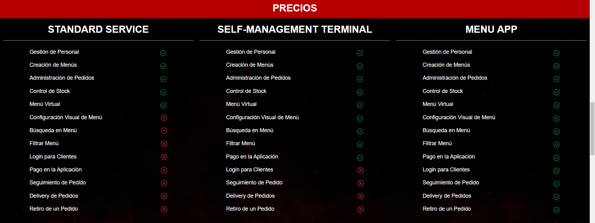

# BAR APP

## Descripción

Nuestra solución web está diseñada para la administración eficiente de establecimientos gastronómicos. Ofrecemos un producto de servicio web que proporciona tres servicios contratables, adaptables a las necesidades específicas de diferentes tipos de establecimientos. Con nuestra plataforma, los restaurantes, cafeterías, bares y establecimientos de comida rápida pueden gestionar sus operaciones diarias de manera más eficaz, mejorando la productividad y la satisfacción del cliente.

## Tabla de Contenidos

1. [Registro Dueños(administrador)](#registroDueño)
3. [Uso Dueños](#usoDueño)
2. [Registro Clientes](#registroCliente)
4. [Uso Cliente](#usoCliente) 
5. [Características](#características)
6. [Planes y Precios](#planes-y-precios)
7. [Soporte](#soporte)
8. [Términos y Condiciones](#términos-y-condiciones)
9. [Contacto](#contacto)

## Registro Dueño(administrador)

Instrucciones sobre cómo registrarse para solicitar una cuenta de adminitrador.

1. Visita [nuestra Landing Page](https://bar-app-services.netlify.app/bar-app/landing-page).
2. Completa el formulario de registro con tus datos.

## Uso Dueño

Guía sobre cómo utilizar el servicio una vez registrado.

1. Inicia sesión en la pagina principal [nuestra plataforma](https://bar-app-services.netlify.app/bar-app/landing-page/auth).
2. Elija un Servicio que se adapte a sus requerimientos.
3. Realice el pago del servicio elegido
4. Una vez impactado el pago, le será otorgado un acceso de admistrador en la web de servicios [BAR APP services](https://bar-app-services.netlify.app/service/login).
5. Inicie sesión con sus mismas credenciales utilizadas en el registro inicial.
6. Utilice las distintas funcionalidades para gestionar su establecimiento.

## Registro Cliente

Instrucciones sobre cómo registrarse y crear una cuenta en el servicio web.

1. Visita [nuestra página de registro](https://bar-app-services.netlify.app/service/register).
2. Completa el formulario de registro con tus datos.
3. Elija un establecimiento gastronómico al cual suscribirse.
4. La habilitación queda sujeta a la aprobación del establecimiento.

## Uso Cliente

Guía sobre cómo utilizar el servicio una vez registrado.

1. Inicia sesión en la pagina principal [nuestra plataforma](https://bar-app-services.netlify.app/bar-app/landing-page/auth).
2. Selecciona productos para agregar al carrito.
3. Revisa el carrito y realiza modificaciones en caso de ser necesario
4. Confirme su pedido y reciba su Número de pedido.
5. En la pestaña "Mi Cuenta", puede cancelar o pagar un pedido y ver el historial de pedidos.

## Características

Lista de las principales características y funcionalidades del servicio web.

    - Habilitar registro de clientes.
    - Registrar personal.
    - Registrar, modificar o borrar un menú.
    - Ver el historial de pedidos.
    - Cambiar el estado de un pedido recibido.
    - Registrar un nuevo pedido.
    - Control de inventario y suministros.
    - Análisis de ventas y reportes financieros.

### Recomendación para Contratar un Servicio

#### Standard Service

Servicio orientado a restaurantes o bares de gestión administrativa tradicional, centralizando las operaciones en un administrador del software que puede delegar tareas al personal como gerentes, para crear un menú por ejemplo, o cajeros y meseros para gestionar la creación, el pago y la entrega de un pedido.

Incluye una página para visualizar un menú digital que podría ser accedido por los clientes mediante un QR o ser visualizado desde una pantalla.

#### Self-Management App

Servicio orientado a negocios de comida rápida que ofrece la agilidad de un software adaptable a un terminal de autogestión donde los clientes podrán ver el menú, realizar un pedido a pagar en caja o incluso pagarlo desde el terminal.

Además incluye toda la gestión de funciones administrativas de creación de un menú, manejo de estados de un pedido, control de inventario y control de personal.

#### Menu App

Servicio pensado en la experiencia del cliente. Con este software, además de poder ver un menú virtual, podrán crearse una cuenta.

Contarán con beneficios como pagar su pedido desde la app, programar un pedido, tener un historial de pedidos e incluso acceder a la opción de delivery en el caso de que tu negocio la tenga disponible.

Además incluye toda la gestión de funciones administrativas de creación de un menú, manejo de estados de un pedido, control de inventario y control de personal.

## Planes y Precios

Información sobre los diferentes planes de suscripción y sus precios.

| Plan                      | Descripción                                      | Precio         |
|---------------------------|--------------------------------------------------|----------------|
| Standard Service          | Funcionalidades básicas                          | 100 usd        |
| Self-Managemente App      | Funcionalidades para terminales de autogestion   | 130 usd        |
| Menu App                  | Funcionalidades completas y soporte              | 150 usd        |

## Soporte

Información sobre cómo obtener soporte técnico o ayuda.

- Visita nuestro [Centro de Ayuda](https://tu-sitio-web.com/ayuda).
- Envíanos un correo a soporte@tu-sitio-web.com.
- Llámanos al +123 456 789.

## Términos y Condiciones

Enlace a los términos y condiciones del servicio.

Puedes leer nuestros [Términos y Condiciones](https://tu-sitio-web.com/terminos).

## Contacto

Información de contacto para preguntas o sugerencias.

- **Nombre**: Tu Nombre
- **Correo**: tuemail@example.com
- **LinkedIn**: [Tu Perfil de LinkedIn](https://linkedin.com/in/tu_perfil)
